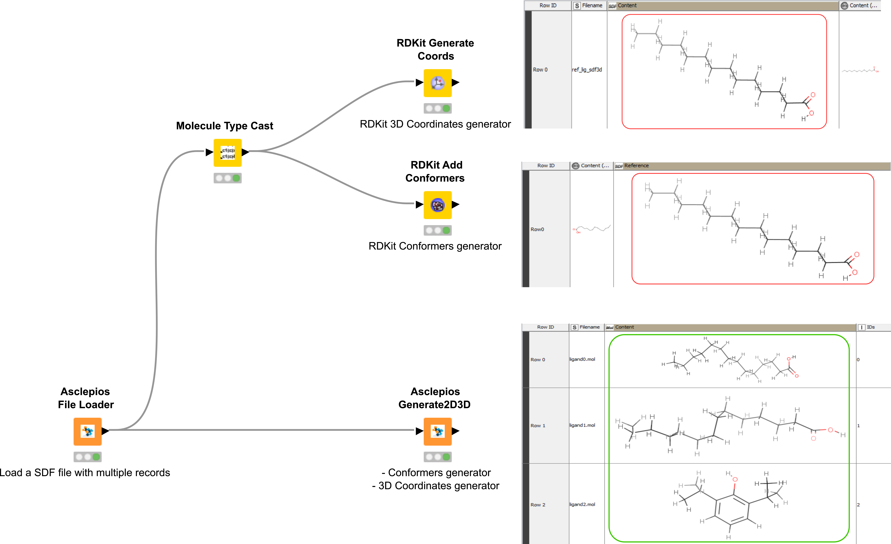

# Asclepios Builder 🛠️

Asclepios Builder class is a collection of nodes for data manipulation of small molecules of specific chemical data type (SDF). Any structural manipulation occurs on a chemical compound of a small molecule such as to generate a 3D conformation from a 2D molecular representation or even adding hydrogens following a specific protonation protocol.

####  Generate 2D/3D Structure (RDKit)

Asclepios Generate 2D/3D node is powered by RDKit[^1] transforms a molecular SD input into its two and three dimensional representations accordingly. In case of multiple SD files into one input (SDF) it generates a data-table of all two and three-dimensional representations accordingly. Asclepios 3D generator uses the ETKDG module [^2]. In addition, the User can select to generate a 3D conformation or a minimized 3D molecular structure based on two classical force fields (MMFF[^3] and UFF[^4]).

Input:

| In-ports | Filename | Content |
| -------- | -------- | -------- |
| port 0   |  `String`   | `sdf` `mol` `String`|

Output:

| Out-ports | Filename | Content | IDs |
| -------- | -------- | -------- |-------- |
| port 0   | `String` | `sdf` `mol` | `Integer`    |

####  Molecule Standardizer

Asclepios Standardizer node creates standardized molecular conformations similar to the ChEMBL data curation pipeline[^5] enhancing the drug discovery Asclepios' functionality.

Asclepios Standardizer carries out the following actions: 

- Standardise unknown stereochemistry.
- Clear S Group data from molfile.
- Generate a kekulé form of the structure.
- Remove explicit H atoms [^5]. 
- Normalise structure [^5]. 
- Ensure molecule is neutralised if possible by: 
    - Adding or removing Hs. 
	- Moving Hs from one to another (including between components). 
- Normalise (straighten) triple bonds and allenes.

[^1]: [RDKit](https://www.rdkit.org/)
[^2]: Shuzhe Wang, Jagna Witek, Gregory A. Landrum, and Sereina Riniker Journal of Chemical Information and Modeling 2020 60 (4), 2044-2058.
[^3]: Halgren, T. A. Merck Molecular Force Field. I. Basis, Form, Scope, Parameterization, and Performance of MMFF94. J. Comput. Chem. 1996, 17, 490–519
[^4]: Rappé, A. K.; Casewit, C. J.; Colwell, K. S.; Goddard, W. A.; Skiff, W. M. UFF, a full periodic table force field for molecular mechanics and molecular dynamics simulations. J. Am. Chem. Soc. 1992, 114, 10024–10035
[^5]: Bento, A.P., Hersey, A., Félix, E. et al. An open source chemical structure curation pipeline using RDKit. J Cheminform 12, 51 (2020). https://doi.org/10.1186/s13321-020-00456-1

Input:

| In-ports | Filename | Content |
| -------- | -------- | -------- |
| port 0   | `String` | 2D molecular conformation `sdf` `mol` `String`|

Output:

| Out-ports | Filename | Content | IDs |
| -------- | -------- | -------- |-------- |
| port 0   | `String` | `sdf` `mol` | `int`   |

####  Add Hydrogens

Asclepios Add Hydrogens node adds the missing hydrogen atoms in the structures based on the atom information from the SDF file loaded through the import. The process is carried out by employing the Open Babel software[^6]. The output is always a 3D molecular conformation.

[^6]: [Open Babel](https://openbabel.org/)

Input:

| In-ports | Filename | Content |
| -------- | -------- | -------- |
| port 0   | `String` | `sdf` `mol` `String` |

Output:

| Out-ports | Input Filename | Filename | Content |
| -------- | -------- | -------- |-------- |
| port 0   | `String` | `String` | `sdf` |

#### Generate 3D Structure (Open Babel)

Asclepios Add3DCoords node facilitates the generation of 3D coordinates for the molecules loaded with Asclepios File Loader. Generation of viable molecular conformation and minimization of the generated structures is important in molecular docking. A correct 3D conformation can provide insight into the mechanism of action of a ligand and help the researcher deduce important information on drug-action. All actions in the node employ the OpenBabel software[^6].

Input:

| In-ports | Filename | Content |
| -------- | -------- | -------- |
| port 0   | `String` | `sdf` `mol` `String` |

Output:

| Out-ports | Filename | Content |
| -------- | -------- | -------- |
| port 0   | `String` | `sdf` |

## Workflows

??? example "2D molecular representation and standardization"

    { align=left }

    

    | Scenario  | Workflow (Nodes involved) | Classes |
    | -------- | -------- | ---------------- |
    | 2D molecular representation and standardization | [File Loader, Generate 2D3D, AddHydrogens, Molecule Standardizer]  | [📄](Asclepios%20General%20Purpose.md "Asclepios General Puprose") [🛠️](Asclepios%20Builder.md "Asclepios Builder") |

    

    

    

    > AddHydrogens Node: red-colored box (1) 

    > Molecule Standardizer: green-colored box (2)

    

    1. A misleading hydrogen assignment during the add hydrogen process.

    2. The wrong hydrogen assignment was fixed after a standardization procedure.

    

    Download workflow [:material-download:](../assets/builder/builder_scenario1.knwf) 
    

??? example "RDKit Nodes Generate 3D (comparison)"

    { align=left }

    

    | Scenario  | Workflow (Nodes involved) | Classes |
    | -------- | -------- | ---------------- |
    | RDKit 3D Geretrators (MGC) with Generate 2D3D | [File Loader &rarr; Molecule Type Cast &rarr; {RDKit Generate Coords, RDKit Add Conformers}]  | [📄](Asclepios%20General%20Purpose.md "Asclepios General Puprose")|
    | Generate 2D3D | [File Loader &rarr; Generate 2D3D]  | [📄](Asclepios%20General%20Purpose.md "Asclepios General Puprose") [🛠️](Asclepios%20Builder.md "Asclepios Builder") |

    

    

    > RDKit Nodes: red-colored box (1).

    > Asclepios Generate3D: green-colored box (2).

    

    1. One component retrived by the RDKit as `SDF`.

    2. Multiple records extrapolation as `Mol`.   

    

    Download workflow [:material-download:](../assets/builder/builder_scenario2.knwf)
    

