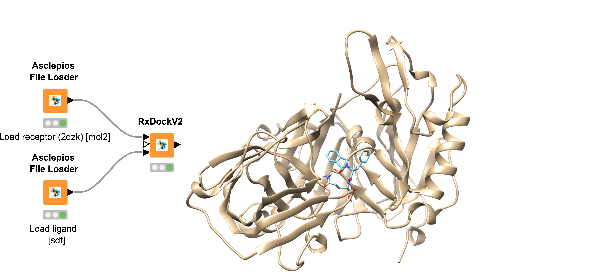

# Asclepios Molecular Docking 💊

Asclepios Molecular Docking class is a collection of nodes for molecular docking. Currently Asclepios medic class supports two molecular docking protocols, AutoDock Vina[^1] and RxDock[^2]. AutoDock Vina and RxDock are two different docking tools with differences on their docking methodology and their data types.

[^1]: Eberhardt, J., Santos-Martins, D., Tillack, A.F., Forli, S. (2021). AutoDock Vina 1.2.0: New Docking Methods, Expanded Force Field, and Python Bindings. Journal of Chemical Information and Modeling.

[^2]: Ruiz-Carmona, S., Alvarez-Garcia, D., Foloppe, N., Garmendia-Doval, A. B., Juhos S., et al. (2014) rDock: A Fast, Versatile and Open Source Program for Docking Ligands to Proteins and Nucleic Acids. PLoS Comput Biol 10(4): e1003571. doi:10.1371/journal.pcbi.1003571

#### RxDock

Asclepios RxDock node is designed to run molecular docking simulations by employing the [RxDock](https://rxdock.gitlab.io/). The purpose of the node is to facilitate molecular docking and virtual screening experiments with various ligand structures (small molecules). Before using the node, it is highly recommended to prepare the various ligands with the preparation nodes included in the Asclepios Builder bundle. Additionally, it is important to prepare the current input file for the protein molecule in Mol2 format.

Input:

| In-ports | Content (Receptor) |
| -------- | -------- |
| port 0   |  `String` `mol2`  |

| In-ports | Content (Reference ligand)|
| -------- | -------- |
| port 1 (optional)   | `String` `mol` `sdf`|

| In-ports | Content (Ligand)|
| -------- | -------- |
| port 2   |  `String` `mol` `sdf` |

Output:

| Out-ports | Filename | Content |
| -------- | -------- | -------- |
| port 0   | `String` | `sdf` |

#### AutoDock Vina

Asclepios AutoDock Vina node can be used for molecular docking and virtual screening of small molecules. Its advanced architecture places it at the forefront of molecular docking, offering excellent computational efficiency and accuracy. Asclepios nodes seamlessly incorporate AutoDock Vina, offering the software as a microservice. This allows users to create consistent computational workflows while utilizing the most appropriate docking protocols for their specific needs.

Input:

| In-ports | Content (Receptor)|
| -------- | -------- |
| port 0   | `String` `pdbqt`|

| In-ports | Content (Ligand)|
| -------- | -------- |
| port 1   | `String` `pdbqt`  |

Output:

| Out-ports | Filename | Content (pose)| Binding Energy |
| -------- | -------- | -------- | -------- |
| port 0   | `String` | `pdb`    | `Double` |

## Workflows

??? example "RxDock: Reference ligand"

    { align=left }

    

    | Scenario  | Workflow (Nodes involved) | Classes |
    | -------- | -------- | ---------------- |
    | RxDock method "reference ligand" | [3 File Loaders {`mol2`, `sdf`, `sdf`} &rarr; RxDock]  | [📄](Asclepios%20General%20Puprose.md "Asclepios General Puprose") [💊](Asclepios%20Molecular%20Docking.md "Asclepios Molecular Docking") |

    Download workflow [:material-download:](../assets/medic/molecular_docking_scenario1.knwf)

    

??? example "RxDock: Two spheres"

    { align=left }

    

    | Scenario  | Workflow (Nodes involved) | Classes |
    | -------- | -------- | ---------------- |
    | RxDock method "two spheres" | [2 File Loaders {`mol2`, `sdf`} &rarr; RxDock]  | [📄](Asclepios%20General%20Puprose.md "Asclepios General Puprose") [💊](Asclepios%20Molecular%20Docking.md "Asclepios Molecular Docking") |

    Download workflow [:material-download:](../assets/medic/molecular_docking_scenario2.knwf)

    

??? example "AutoDock Vina and data type transformation"

    { align=left }

    

    | Scenario  | Workflow (Nodes involved) | Classes |
    | -------- | -------- | ---------------- |
    | AutoDock Vina | [2 File Loaders {receptor:`mol2`, ligand:`sdf`} &rarr; 2 Transformers {receptor,ligand} &rarr; AutoDock Vina]  | [📄](Asclepios%20General%20Puprose.md "Asclepios General Puprose") [🧬](Asclepios%20Utilizer.md "Asclepios Utilizer") [💊](Asclepios%20Molecular%20Docking.md "Asclepios Molecular Docking") |

    Download workflow [:material-download:](../assets/medic/molecular_docking_scenario3.knwf)

    

