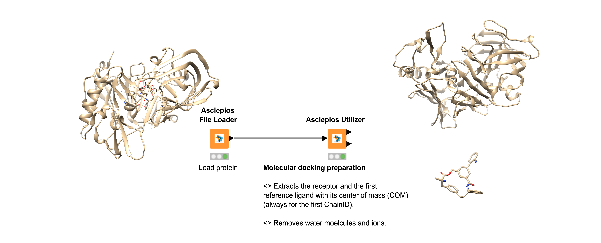
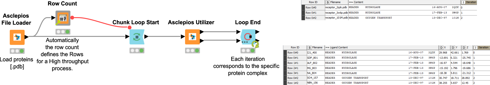

# Asclepios Utilizer 🧬 

The Asclepios Utilizer class, which provides a protocol for structural data processing regarding proteins and biological compounds, powered by the MDAnalysis [^1] and PDBFixer [^2] libraries.

####  Utilizer

Asclepios Utilizer node is powered by MDAnalysis, an object-oriented Python library to analyze trajectories from molecular dynamics (MD) simulations in many popular formats. Utilizer processes structural input data to identify and separate the receptor (protein) and its reference ligand based on a specific chain (currently defaulting to first chainID). It removes crystallographic water molecules while preserving co-factors bound to the receptor.

- Automatically detects and processes the first available chain (chainID='A').
- Separates receptor and reference ligand.
- Removes crystallographic water molecules.
- Preserves co-factor information.
- Calculates center of mass (COM) of the reference ligand.
- Extracts reference ligand (excluding water and co-factors).
- Preserves the co-factors 	(`HEM`,`NAD`,`NADP`,`NADPH`,`FAD`,`FMN`,`ATP`,`ADP`,`AMP`,`COA`).

[^1]:R. J. Gowers, M. Linke, J. Barnoud, T. J. E. Reddy, M. N. Melo, S. L. Seyler, D. L. Dotson, J. Domanski, S. Buchoux, I. M. Kenney, and O. Beckstein. MDAnalysis: A Python package for the rapid analysis of molecular dynamics simulations. In S. Benthall and S. Rostrup, editors, Proceedings of the 15th Python in Science Conference, pages 98-105, Austin, TX, 2016

Input:

| In-ports | Filename | Content |
| -------- | -------- | -------- |
| port 0   | `String` |  `String` or `pdb`   |

Output:

| Out-port | Filename | Datatype |
| -------- | -------- | -------- |
| port 0   |  `String` |  `pdb`   |

| Out-port | Filename | Ligand Content | x | y | z |
| -------- | -------- | -------- |-------- |-------- |-------- |
| port 1   |  `String` |  `pdb`   | `Double` | `Double` | `Double` |

 

####  PDBFixer

Asclepios PDBFixer node repairs and prepares experimental biomolecular structures for simulation. It addresses common issues such as missing residues or atoms, non-standard amino acids, and unwanted heterogens. By integrating with the OpenMM[^2] molecular simulation toolkit, PDBFixer can add hydrogens at a specified pH, repair connectivity (e.g., peptide bonds), and perform energy minimization to relax the structure into a stable conformation. This combination provides an efficient and reliable workflow for preparing molecular models for simulation or further analysis.

The node carries out the following actions: 

- Add missing heavy atoms.
- Add missing hydrogen atoms based on an internal template.
- Build missing loops.
- Convert non-standard residues to their standard equivalents. 
- Select a single position for atoms with multiple alternatepositions listed.
- Delete unwanted chains from the model.
- Delete unwanted heteroatoms.

[^2]:P. Eastman, J. Swails, J. D. Chodera, R. T. McGibbon, Y. Zhao, K. A. Beauchamp, L.-P. Wang, A. C. Simmonett, M. P. Harrigan, C. D. Stern, R. P. Wiewiora, B. R. Brooks, and V. S. Pande. “OpenMM 7: Rapid development of high performance algorithms for molecular dynamics.” PLOS Comp. Biol. 13(7): e1005659. (2017)

Input:

| In-ports | Filename | Content |
| -------- | -------- | -------- |
| port 0   | `String` |  `String` or `pdb`   |

Output:

| Out-ports | Filename | Content |
| -------- | -------- | -------- |
| port 0   |  `String`  |  `pdb` |

| Out-ports (optional) | Filename | Content |
| -------- | -------- | -------- |
| port 1   |  `String`  |  `pdb`   |
| port 2   |  `String`  |  `pdb`   |

####  Get PDB and Get mmCIF/PDBx
Get PDB node retrieves the PDB structures that correspond to the PDB codes provided by the user. The Get CIF node retrieves the PDBx/mmCIF files, from the protein databank that contain structures corresponding to the PDB ID provided by the user. Data in both case are obtained from RCSB PDB data center [^3].

[^3]: [RCSB PDB](https://www.rcsb.org/)

Output [Get PDB]:

| Out-ports | PDB ID | Content |
| -------- | -------- | -------- |
| port 0   |  `String`  |  `pdb`   |

Output [Get mmCIF/PDBx]:

| Out-ports | Input ID | PDB Content | CIF Content | Extra info |
| -------- | -------- | -------- |  -------- | -------- |
| port 0   |  `String` | `pdb` | `String` | `String` |

#### Transformer

Asclepios Transformer node transforms different data types following a well defined transformation protocol [^4] (where in case of small molecules `sdf` &rarr; `pdb` the RDKit [^5] transformation protocol has been used). Transformer streamlines molecular file format conversions for molecular docking and molecular dynamics simulations. 

The following transformations can be executed: 

- PDB (small molecules and macromolecules)
- SDF/Mol (small molecules)
- Mol2 (small molecules and macromolecules)
- PDBQT (small molecules and mcromolecules)

!!! note
    In case of conversion of a small molecule or a protein in a PDBQT format  the following manipulations occur.

    - Addition of atomic partial charges.
    - Adding torsion degrees of freedom in case of small molecules.

[^4]: O'Boyle, N.M., Banck, M., James, C.A. et al. Open Babel: An open chemical toolbox. J Cheminform 3, 33 (2011)

[^5]: [RDKit](https://www.rdkit.org/)

Input:

| In-ports | Filename | Content |
| -------- | -------- | -------- |
| port 0   |  `String`   | `sdf` `mol` `pdb` `pdbqt` `mol2`|

Output:

| Out-ports | Filename | Content |
| -------- | -------- | -------- |
| port 0   | `String` | `sdf` `mol` `pdb` `pdbqt` `mol2` |

## Workflows

??? example "Load a set of proteins"

    { align=left }

    

    | Scenario  | Workflow (Nodes involved) | Classes |
    | -------- | -------- | ---------------- |
    | Load a set of proteins | [Get PDB]  | [🧬](Asclepios Utilizer.md "Utilizer") |

    Download workflow [:material-download:](../assets/utilizer/utilizer_scenario1.knwf)
    

??? example "Load a protein for docking preparation"

    { align=left }

    

    
    

    | Scenario  | Workflow (Nodes involved) | Classes |
    | -------- | -------- | ---------------- |
    | Load a protein for docking preparation | [File Loader &rarr; Utilizer] | [📄](Asclepios General Puprose.md "Asclepios General Puprose")[🧬](Asclepios Utilizer.md "Asclepios Utilizer") |

    Download workflow [:material-download:](../assets/utilizer/utilizer_scenario2.knwf)

    

??? example "Load a set proteins for docking preparation (high-throughput screening)"

    { align=left }

    

    | Scenario  | Workflow (Nodes involved) | Classes |
    | -------- | -------- | ---------------- |
    | Load a set proteins for docking preparation (high-throughput screening) | [File Loader &rarr; Utilizer] | [📄](Asclepios General Puprose.md "Asclepios General Puprose")[🧬](Asclepios Utilizer.md "Asclepios Utilizer") |

    Download workflow [:material-download:](../assets/utilizer/utilizer_scenario3.knwf)

    

??? example "Load a protein and fix the structure (ie. adding missing residues and removing water molecules)"

    { align=left }

    

    | Scenario  | Workflow (Nodes involved) | Classes |
    | -------- | -------- | ---------------- |
    | Load a protein and fix the structure (ie. adding missing residues and removing water molecules)| [File Loader &rarr; PDBFixer &rarr; Utilizer]  | [🧬](Asclepios Utilizer.md "Asclepios Utilizer") |

    

    

    > blue-colored representation (1) and the grey oval area sketced the adding residues.

    

    1.  PDB fixed

    

    Download workflow [:material-download:](../assets/utilizer/utilizer_scenario4.knwf)
    
 

??? example "Preserves chemical information of proteins"

    { align=left }

    

    | Scenario  | Workflow (Nodes involved) | Classes |
    | -------- | -------- | ---------------- |
    | Preserves chemical information of proteins | [File Loader &rarr; Transformer {`PDB`  &rarr; `Mol2`} &rarr; Transformer {`Mol2`  &rarr; `PDB`}]  | [📄](Asclepios General Puprose.md "Asclepios General Puprose") [🧬](Asclepios Utilizer.md "Asclepios Utilizer") |

    

    

    > Colored is the protein representation following the transformations.

    

    

    Download workflow [:material-download:](../assets/utilizer/utilizer_scenario5.knwf)
    

??? example "Preserves chemical inforamtion of small molecules"

    { align=left }

    

    | Scenario  | Workflow (Nodes involved) | Classes |
    | -------- | -------- | ---------------- |
    | Preserves chemical inforamtion of small molecules [`PDB`]| [File Loader &rarr; Transformer {`SDF`  &rarr; `PDB`} &rarr; Transformer {`PDB`  &rarr; `SDF`}]  | [📄](Asclepios General Puprose.md "Asclepios General Puprose") [🧬](Asclepios Utilizer.md "Asclepios Utilizer") |
    | Preserves chemical inforamtion of small molecules [`Mol2`]| [File Loader &rarr; Transformer {`SDF`  &rarr; `Mol2`} &rarr; Transformer {`Mol2`  &rarr; `SDF`}]  | [📄](Asclepios General Puprose.md "Asclepios General Puprose") [🧬](Asclepios Utilizer.md " Asclepios Utilizer") |

    Download workflow [:material-download:](../assets/utilizer/utilizer_scenario6.knwf)

    

??? warning "The case of a small molecule consistent by more than one residue presents a failure data type conversion during a Mol2 to PDB data type transformation."
    

    { align=left }

    

    | Scenario  | Workflow (Nodes involved) | Classes |
    | -------- | -------- | ---------------- |
    | `Mol2` &rarr; `SDF`| [File Loader &rarr; Transformer {`Mol2`  &rarr; `SDF`}] | [📄](Asclepios General Puprose.md "Asclepios General Puprose") [🧬](Asclepios Utilizer.md "Asclepios Utilizer") |
    | `Mol2` &rarr; `PDB`| [File Loader &rarr; Transformer {`Mol2`  &rarr; `PDB`}] | [📄](Asclepios General Puprose.md "Asclepios General Puprose") [🧬](Asclepios Utilizer.md "Asclepios Utilizer") |

    Download workflow [:material-download:](../assets/utilizer/utilizer_scenario7.knwf) 

    

??? warning "The case of a small molecule transformation (y3c.sdf) where there is a missing atoming bond during PDBQT."
    

    { align=left }

    

    | Scenario  | Workflow (Nodes involved) | Classes |
    | -------- | -------- | ---------------- |
    | `SDF` &rarr; `Mol2` &rarr; `SDF`| [File Loader &rarr; Transformer {`SDF`  &rarr; `Mol2`} &rarr; Transformer {`Mol2`  &rarr; `SDF`}] | [📄](Asclepios%20General%20Purpose.md "Asclepios General Puprose") [🧬](Asclepios Utilizer.md "Asclepios Utilizer") |
    | `SDF` &rarr; `PDBQT` &rarr; `SDF`| [File Loader &rarr; Transformer {`SDF`  &rarr; `PDBQT`} &rarr; Transformer {`PDBQT`  &rarr; `SDF`}] | [📄](Asclepios%20General%20Purpose.md "Asclepios General Puprose") [🧬](Asclepios%20Utilizer.md "Asclepios Utilizer") |

    
    

    
    

    > Transformer `SDF` &rarr; `PDBQT`: red-colored box (1) 

    > Transformer `PDBQT` &rarr; `SDF`: green-colored box (2)

    

    1. A missing bonding information.

    2. The bonding information has been retrived following an 
    SDF transfromation.

    

    Download workflow [:material-download:](../assets/utilizer/utilizer_scenario8.knwf) 
    

